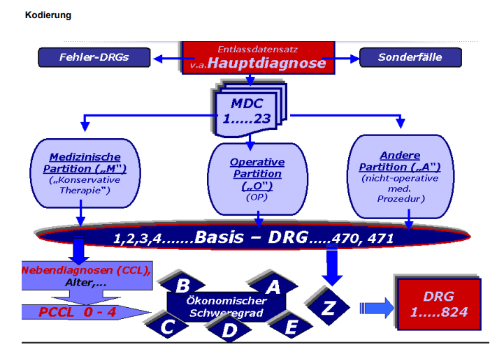
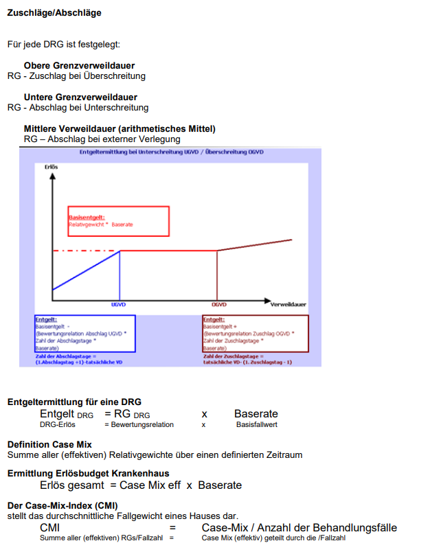

### Diagnosis Related Groups (DRG)
DRG's sind ein Patientenklassifikationssystem mit dem einzelne **stationäre** Behandlungsfälle anhand bestimmter Kriterien zu Fallgruppen zusammengefasst werden.
* Pro Behandlungsfall wird eine DRG zugewiesen

**Ziele:**
- Ökonomisch homogen
- Medizinisch homogen

---

### Kodierung

**4-stellige Nomenklatur:**
- Zeichen: 1 Hauptgruppe (MDC)
  - A: Pre-MDC (Sonderfälle)
  - 9: Fehler-DRGs
  - B-Z: Hauptgruppen
- Zeichen: 2 und 3 Basis (DRG)
  - 01-39: chrirurgische Partition mindestens 1 OR-Prozedur
  - 40-59: andere Partition keine OR, mindestens 1 NonOR-Prozedur
  - 60-99: medizinische Partition weder OR, noch NonOR-Prozedur
- Zeichen: 4 CC-Kategorie
  - A-E: ökonomische Schweregrad
  - Z: keine Unterteilung nach Schweregrad (Z-DRG)

**PCCL:**
- Patient Clinical Complexity Level
- 0-4: Schweregrad (0: keine, 4: sehr schwer)

---

### Zuschläge/Abschläge

**Entgeltermittlung für eine DRG:**
- Entgeld für DRG = Relatives Kostengewicht (RG) * Basisfallwert (BFW)

**Definition Case Mix:**
Summe aller Relativgewichte (RG) über einen definierten Zeitraum

**Ermittlung Erlösbudget Krankenhaus:**
- Erlösbudget = Case Mix * Basisfallwert

**Case Mix Index (CMI):**
- Durchnittliches Fallgewicht eines Krankenhauses
- CMI = Case Mix / Anzahl der Behandlungsfälle

**Bedeutung der medizinischen Dokumentation:**
- Vollständigkeit und Korrektheit der Kodierung entscheidet über die Zuweisung eines Patienten zu einer DRG. 
- Die korrekte und vollständige Kodierung bestimmt unmittelbar die Erlösentwicklung und ist somit **von existenzieller Bedeutung** für das Krankenhaus.