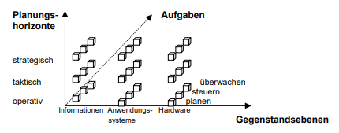
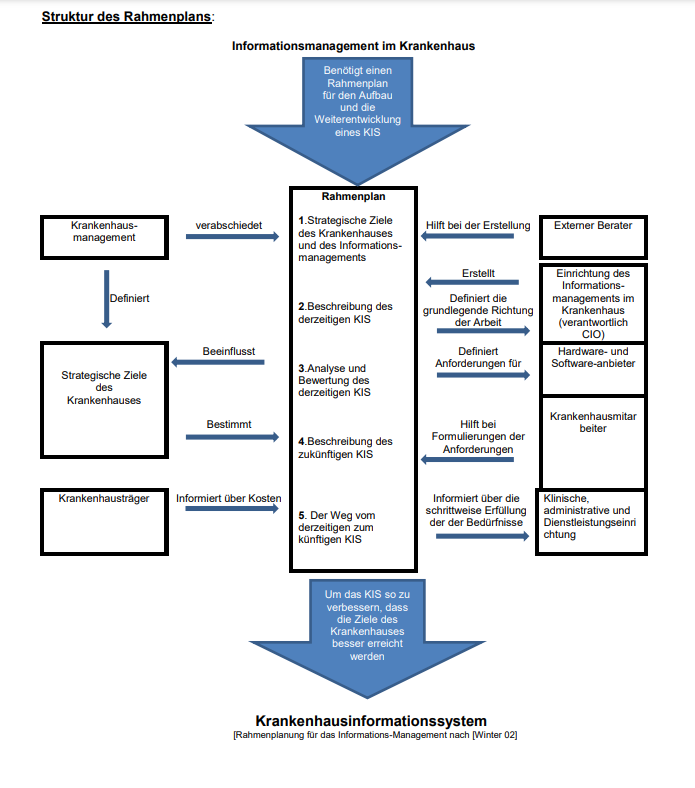

### Management von Krankenhausinformationssystemen
Das Informationsmanagement gliedert sich in 3 grundzätzliche Teilbereiche:
1. Information
2. Anwendungsbausteine
3. Rechnerbasierte/konventionelle Informations- und Kommunikationssysteme

und in 3 Planungshorizonte:
1. Strategische Planung
2. Taktische Planung
3. Operative Planung

---

### Strategisches KIS-Management

**Strategisches Ziel:**
Primäres Ziel aller Krankenhäuser ist neben den ökonomischen Zielen der den Patientenversorgungsauftrag sehr gut zu erfüllen und ein dementsprechendes Leistungsspektrum anzubieten.

**Zustandsbeschreibung:**
Als erster Schritt einer neuen KIS Planung muss der Ist-Zustand beschrieben werden. Die erfordert
ein hohes Maß an Disziplin aller Beteiligten und Fingerspitzengefühl des Verantwortlichen, um ein
möglichst vollständiges Bild mit allen Relationen zu erhalten. Dabei muss identifiziert werden, welche
Bereiche bereits gut durch IT unterstützt werden und in welchen Bereichen es weiterer Unterstützung
bedarf. Es müssen alle vorhandenen Anwendungsbausteine und die derzeit eingesetzte
Informations- und Kommunikationstechnologie hinsichtlich ihres Beitrags zur Unterstützung der
Aufgaben des Krankenhauses beschrieben werden. Ein wichtiger Baustein ist in diesem
Zusammenhang auch die Organisation des Informationssystems und des Informationsmanagements!
Probleme der Informationsverarbeitung haben nicht immer einen technischen Hintergrund.

**Analyse und Bewertung:**
Nach der Beschreibung folgt die Analyse des Ist-Zustandes hinsichtlich der strategischen Ziele des
Krankenhauses und der Informationsverarbeitung.
Nicht in jedem Fall ist der Einsatz informationsverarbeitender Werkzeuge notwendig und zielführend.
Papiergebundene Befunddokumentation im Patientenzimmer kann auch bewusst als Ziel definiert
werden, um den Patienten in den Vordergrund zu stellen!

**Sollkonzeption:**
Aus dem Ergebnis der Analyse und Bewertung des derzeitigen Zustands resultieren die
Anforderungen an ein künftiges KIS. Dabei ist sowohl zu prüfen, welche neuen Technologien und
Entwicklungen anstehen, als auch, welche organisatorischen Verbesserungen des
Informationsmanagements erforderlich sind und welche Konsequenzen dies beispielsweise für die
personelle Ausstattung hat. In diesem Kontext ist ggf. die Benennung eines Chief Information Officer
(CIO) und die Festlegung seiner Kompetenzen und Verantwortung zielführend.

**Migrationsweg:**
Der letzte Abschnitt des Rahmenplans soll Schritt für Schritt aufzeigen, wie der Weg von der IstSituation zum künftigen KIS stattfinden soll. Es müssen die Vorgaben für das taktische Management
(z.B.: Personal, Investitionskosten, Zeitschiene etc.) beschrieben und auch künftige Betriebskosten
mitberücksichtigt werden. Projekte sind nach Priorität und ihren Abhängigkeiten einzuordnen.
